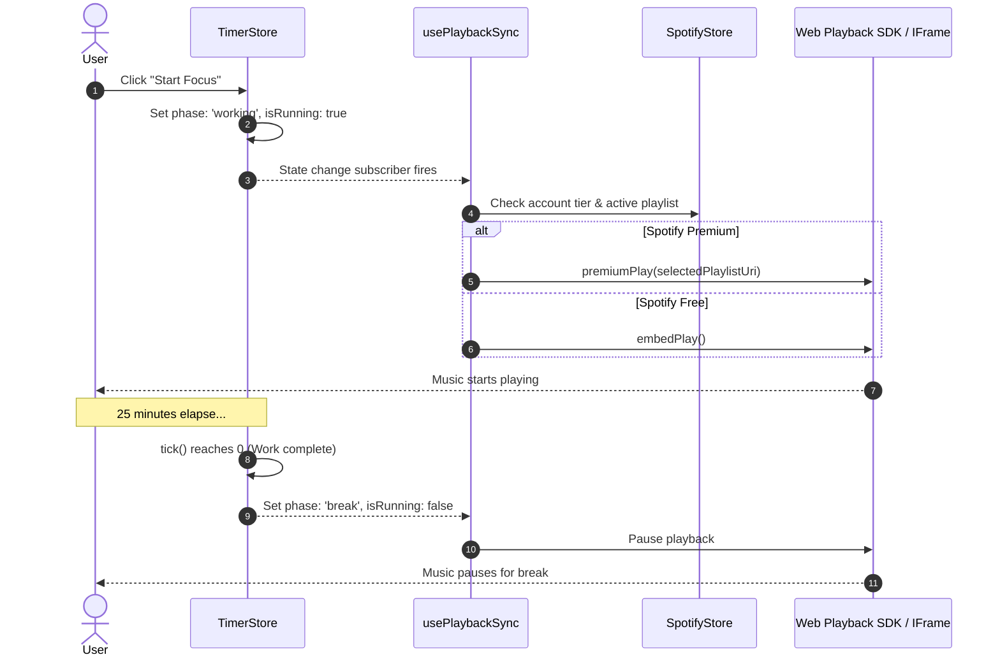
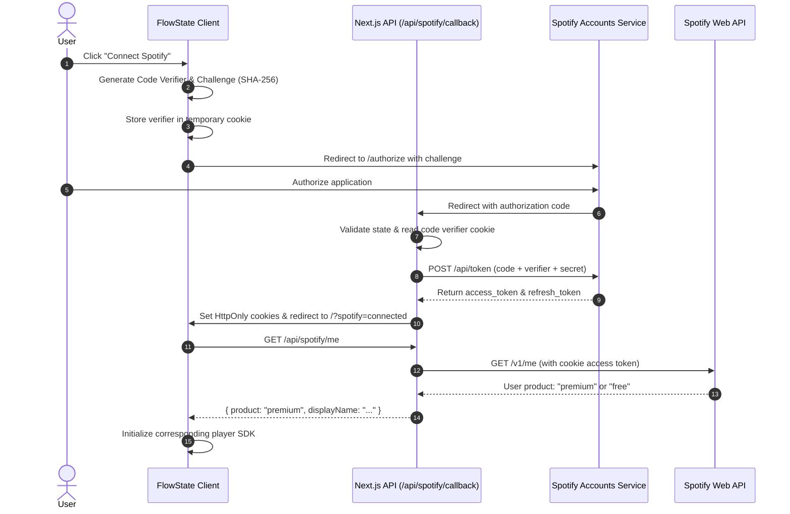

# FlowState

<div align="center">


**A mindful, aesthetic Pomodoro focus application that seamlessly synchronizes your deep work sessions with Spotify music.**

[](https://nextjs.org/)
[](https://react.dev/)
[](https://www.typescriptlang.org/)
[](https://tailwindcss.com/)
[](https://github.com/pmndrs/zustand)
[](https://developer.spotify.com/)
[](LICENSE)

[Features](#key-features) • [Getting Started](#getting-started) • [Spotify Setup](#spotify-developer-setup) • [Architecture](#architecture) • [API Routes](#api-reference) • [Deployment](#deployment)

</div>

---

## Overview

**FlowState** is a distraction-free Pomodoro timer tailored for high-focus deep work. Crafted with a calming sage-and-lavender pastel aesthetic, it goes beyond traditional timers by directly syncing your focus sessions with Spotify.

When you start your work sprint, your focus soundtrack automatically begins. When your timer reaches zero or you pause to catch your breath, your music gently pauses—eliminating context switching and helping you effortlessly sustain your flow state.

---

## Key Features

### ⏱️ Adaptive Pomodoro Timer
- **Curated Work/Break Presets**:
  - `25 / 5` — Classic Pomodoro with a 10-minute long break.
  - `50 / 10` — Extended deep-dive block with a 20-minute long break.
  - `90 / 15` — Ultradian rhythm sprint with a 30-minute long break.
- **Custom Duration Support**: Enter custom minutes or decimal hours (e.g., `1.5` for 90 minutes). The system automatically calculates optimal break lengths with instant manual override options (`5m`, `10m`, `15m`, `20m`).
- **Automated Long Break Tracking**: Tracks completed cycles and automatically promotes every 4th session to a restorative Long Break.
- **Persistent Daily Statistics**: Tracks completed pomodoros and total minutes focused today, persisted to `localStorage` across reloads and tab closures.

### 🎵 Smart Spotify Music Synchronization
- **Playback Synchronization**:
  - Starts music playback when a work session starts or resumes.
  - Automatically pauses music during short breaks, long breaks, and manual pauses.
- **Adaptive Account Support**:
  - **Spotify Premium**: Integrated with the **Spotify Web Playback SDK** for native in-browser playback, live album art, track/artist display, and track skipping controls.
  - **Spotify Free**: Automatically loads an embedded **Spotify IFrame Player API**, giving Free users access to full focus playlists without requiring a Premium subscription.
- **Curated & Custom Playlists**: One-click selection of curated playlists (*Lofi Beats*, *Peaceful Piano*, *Chill Vibes*) or paste any public Spotify playlist URL.

### 🌿 Zen Aesthetic & Sensory Feedback
- **SVG Circular Progress Indicator**: Smooth, animated progress ring with phase-adaptive color states:
  - **Sage Green** (`#a3b899`) — Work & Focus
  - **Soft Lavender** (`#c4b5d4`) — Short Break
  - **Warm Sand** (`#d4c5a0`) — Long Break
- **Synthesized Web Audio Chime**: Generates a gentle 528 Hz sine chime via the browser's native `AudioContext`—zero external audio files or network requests required.
- **Desktop Web Notifications**: Alerts you via native browser notifications when work sessions complete or breaks conclude, even if the tab is in the background.

### 🔒 Secure Architecture
- **PKCE OAuth 2.0 Flow**: Proof Key for Code Exchange with cryptographic challenge verification and CSRF state validation.
- **HttpOnly Cookie Tokens**: Spotify access and refresh tokens are stored exclusively in secure `HttpOnly` cookies, preventing XSS token theft.
- **Server Proxy API Routes**: Client code never makes direct token-authenticated requests to Spotify APIs; internal Next.js server routes act as a secure proxy.
- **Hardened HTTP Headers**: Strict security headers configured via `next.config.mjs` (`X-Frame-Options: DENY`, `X-Content-Type-Options: nosniff`, etc.).

---

## Tech Stack

| Layer | Technology | Description |
| :--- | :--- | :--- |
| **Framework** | [Next.js 14](https://nextjs.org/) | App Router, Server Components & Route Handlers |
| **Language** | [TypeScript 5](https://www.typescriptlang.org/) | End-to-end type safety |
| **UI Library** | [React 18](https://react.dev/) | Component-driven UI |
| **Styling** | [Tailwind CSS 3.4](https://tailwindcss.com/) | Custom pastel theme (`sage`, `lavender`, `cream`) |
| **State Management** | [Zustand 5](https://github.com/pmndrs/zustand) | Client state stores with persistence for timer and Spotify state |
| **Music Integration** | [Spotify Web Playback SDK](https://developer.spotify.com/documentation/web-playback-sdk) & [IFrame API](https://developer.spotify.com/documentation/embeds/tutorials/using-the-iframe-api) | Audio streaming for Premium & Free tiers |
| **Audio Synthesis** | Web Audio API (`AudioContext`) | In-browser 528 Hz completion tone generation |

---

## Prerequisites

Before setting up FlowState locally, ensure you have:

- **Node.js**: `v18.17.0` or higher (Node 20+ recommended)
- **Package Manager**: `npm`, `pnpm`, `yarn`, or `bun`
- **Spotify Account**: Free or Premium account
- **Spotify Developer Application**: A registered app in the [Spotify Developer Dashboard](https://developer.spotify.com/dashboard)

---

## Spotify Developer Setup

To connect Spotify with FlowState, create an application on the Spotify Developer Dashboard:

1. Go to the [Spotify Developer Dashboard](https://developer.spotify.com/dashboard) and log in.
2. Click **Create App** and fill in the application details:
   - **App name**: `FlowState` (or your preferred name)
   - **App description**: `Pomodoro timer with synchronized music playback`
   - **Redirect URI**: `http://localhost:3000/api/spotify/callback`
   - **Which API/SDKs are you planning to use?**: Select **Web API** and **Web Playback SDK**.
3. Accept the Spotify Developer Terms and click **Save**.
4. Go to **Settings** on your app page to find your:
   - **Client ID**
   - **Client Secret** (click *View client secret*)

> [!IMPORTANT]
> Ensure that `http://localhost:3000/api/spotify/callback` is listed under **Redirect URIs** in your Spotify app settings. If deploying to production, add your production callback URL as well (e.g., `https://your-domain.com/api/spotify/callback`).

---

## Getting Started

### 1. Clone the Repository

```bash
git clone https://github.com/Aaru5h/FlowState.git
cd FlowState
```

### 2. Install Dependencies

```bash
npm install
# or
pnpm install
# or
yarn install
```

### 3. Configure Environment Variables

Copy the sample environment file:

```bash
cp .env.example .env.local
```

Open `.env.local` and add your Spotify credentials:

```env
# Client-side (Public)
NEXT_PUBLIC_SPOTIFY_CLIENT_ID=your_spotify_client_id_here
NEXT_PUBLIC_SPOTIFY_REDIRECT_URI=http://localhost:3000/api/spotify/callback

# Server-side (Private / Secret)
SPOTIFY_CLIENT_ID=your_spotify_client_id_here
SPOTIFY_CLIENT_SECRET=your_spotify_client_secret_here
SPOTIFY_REDIRECT_URI=http://localhost:3000/api/spotify/callback
```

### 4. Run the Development Server

```bash
npm run dev
```

Open [http://localhost:3000](http://localhost:3000) in your browser.

---

## Environment Variables

| Variable | Scope | Description | Example |
| :--- | :--- | :--- | :--- |
| `NEXT_PUBLIC_SPOTIFY_CLIENT_ID` | Client | Public Spotify Client ID for initiating PKCE auth | `a1b2c3d4...` |
| `NEXT_PUBLIC_SPOTIFY_REDIRECT_URI` | Client | Public OAuth redirect target | `http://localhost:3000/api/spotify/callback` |
| `SPOTIFY_CLIENT_ID` | Server | Server-side Client ID for token exchange & refresh | `a1b2c3d4...` |
| `SPOTIFY_CLIENT_SECRET` | Server | Spotify Client Secret for authorization header | `e5f6g7h8...` |
| `SPOTIFY_REDIRECT_URI` | Server | Server-side OAuth redirect match validation | `http://localhost:3000/api/spotify/callback` |

---

## Architecture

### Directory Structure

```
.
├── src/
│   ├── app/
│   │   ├── api/
│   │   │   └── spotify/
│   │   │       ├── callback/       # OAuth token exchange & HttpOnly cookie storage
│   │   │       ├── logout/         # Clears session cookies
│   │   │       ├── me/             # Fetches Spotify profile & account tier
│   │   │       ├── next/           # Proxy to skip track on active device
│   │   │       ├── play/           # Proxy to trigger playback on active device
│   │   │       ├── refresh/        # Refreshes expired access tokens
│   │   │       └── token/          # Returns active access token for SDK init
│   │   ├── globals.css             # Tailwind base and global style declarations
│   │   ├── layout.tsx              # Root HTML shell & Geist font configuration
│   │   └── page.tsx                # Home page mounting FlowstateApp
│   ├── components/
│   │   ├── FlowstateApp.tsx        # Orchestrator component tying timer and music together
│   │   ├── FreePlayerEmbed.tsx     # Spotify IFrame Embed API for Free tier users
│   │   ├── MusicPanel.tsx          # Main Spotify widget container & login prompt
│   │   ├── PlaylistPicker.tsx      # Curated playlist pills & custom URL parser
│   │   ├── PremiumPlayerWidget.tsx # Web Playback SDK player with album art & controls
│   │   ├── TimerCircle.tsx         # SVG animated circular countdown ring
│   │   └── TimerControls.tsx       # Presets, custom input, start/pause/reset, stats
│   ├── hooks/
│   │   ├── usePlaybackSync.ts      # Bi-directional sync between timer state & music
│   │   ├── useSpotifyAuth.ts       # PKCE authentication lifecycle & session checks
│   │   ├── useSpotifyEmbed.ts      # Spotify IFrame Embed controller
│   │   ├── useSpotifyPlayer.ts     # Spotify Web Playback SDK controller
│   │   └── useTimer.ts             # 1-second ticker, audio chime, and notifications
│   ├── lib/
│   │   ├── sounds.ts               # Web Audio API 528 Hz sine wave chime
│   │   ├── spotify.ts              # PKCE verifier/challenge utils & curated playlists
│   │   └── timer.ts                # Presets, phase transitions, and break calculations
│   └── store/
│       ├── spotifyStore.ts         # Zustand store for Spotify session and playback state
│       └── timerStore.ts           # Zustand store for timer configuration & local persistence
├── .env.example                    # Sample environment variables template
├── next.config.mjs                 # Security headers & Spotify image domains
├── tailwind.config.ts              # Custom pastel palette configuration
└── tsconfig.json                   # TypeScript configuration
```

### Playback Synchronization Flow



### Authentication Flow (PKCE with HttpOnly Cookies)



---

## API Reference

FlowState includes a set of Next.js Route Handlers in `src/app/api/spotify/` that proxy requests securely to the Spotify Web API.

### `GET /api/spotify/callback`
Exchanges the temporary authorization code from Spotify OAuth for access and refresh tokens. Sets secure, `HttpOnly`, `SameSite=lax` session cookies and redirects the user back to the application.

### `GET /api/spotify/me`
Fetches the current user's profile from Spotify using the active session token to determine account tier (`premium` vs `free`).
- **Response**:
  ```json
  {
    "product": "premium",
    "displayName": "User Name"
  }
  ```

### `GET /api/spotify/token`
Returns the decrypted access token from server cookies. Used exclusively by client-side Web Playback SDK initialization.

### `PUT /api/spotify/play`
Transfers and initiates playlist playback to a specific Spotify device.
- **Request Body**:
  ```json
  {
    "deviceId": "string",
    "contextUri": "spotify:playlist:0vvXsWCC9xrXsKd4FyS8kM"
  }
  ```

### `POST /api/spotify/next`
Skips to the next track on the active Spotify player device.
- **Request Body**:
  ```json
  {
    "deviceId": "string"
  }
  ```

### `POST /api/spotify/refresh`
Uses the stored `spotify_refresh_token` to retrieve a fresh `spotify_access_token` and updates the session cookies.

### `POST /api/spotify/logout`
Clears all Spotify-related cookies (`spotify_access_token`, `spotify_refresh_token`), resetting the user's session.

---

## Available Scripts

In the project directory, you can run:

| Command | Action |
| :--- | :--- |
| `npm run dev` | Starts the development server at `http://localhost:3000` with hot reloading. |
| `npm run build` | Compiles the production build, linting code and checking TypeScript types. |
| `npm run start` | Starts the production Next.js server (run after `npm run build`). |
| `npm run lint` | Runs ESLint across all components, hooks, and API routes. |

---

## Deployment

### Deploying to Vercel

The fastest way to deploy FlowState is using [Vercel](https://vercel.com/):

1. Push your code to a GitHub, GitLab, or Bitbucket repository.
2. Import the repository into the **Vercel Dashboard**.
3. In **Settings > Environment Variables**, add your Spotify credentials:
   - `NEXT_PUBLIC_SPOTIFY_CLIENT_ID`
   - `NEXT_PUBLIC_SPOTIFY_REDIRECT_URI` (set to `https://your-domain.vercel.app/api/spotify/callback`)
   - `SPOTIFY_CLIENT_ID`
   - `SPOTIFY_CLIENT_SECRET`
   - `SPOTIFY_REDIRECT_URI` (set to `https://your-domain.vercel.app/api/spotify/callback`)
4. In your [Spotify Developer Dashboard](https://developer.spotify.com/dashboard), add your production callback URL (`https://your-domain.vercel.app/api/spotify/callback`) to **Redirect URIs**.
5. Click **Deploy**.

### Docker Deployment

To containerize and run FlowState with Docker:

```dockerfile
# Dockerfile
FROM node:20-alpine AS builder
WORKDIR /app
COPY package*.json ./
RUN npm ci
COPY . .
RUN npm run build

FROM node:20-alpine AS runner
WORKDIR /app
ENV NODE_ENV=production
COPY --from=builder /app/public ./public
COPY --from=builder /app/.next ./.next
COPY --from=builder /app/node_modules ./node_modules
COPY --from=builder /app/package.json ./package.json

EXPOSE 3000
CMD ["npm", "start"]
```

Build and run the container:

```bash
docker build -t flowstate-pomodoro .
docker run -p 3000:3000 \
  -e NEXT_PUBLIC_SPOTIFY_CLIENT_ID="your_id" \
  -e NEXT_PUBLIC_SPOTIFY_REDIRECT_URI="http://localhost:3000/api/spotify/callback" \
  -e SPOTIFY_CLIENT_ID="your_id" \
  -e SPOTIFY_CLIENT_SECRET="your_secret" \
  -e SPOTIFY_REDIRECT_URI="http://localhost:3000/api/spotify/callback" \
  flowstate-pomodoro
```

---

## Troubleshooting

### 1. Spotify Auth: `INVALID_CLIENT: Invalid redirect URI`
- **Cause**: The redirect URI passed by the app does not match the URI configured in Spotify's Developer Dashboard.
- **Fix**: Open the [Spotify Developer Dashboard](https://developer.spotify.com/dashboard), select your app, go to **Settings**, and ensure `http://localhost:3000/api/spotify/callback` is exact (watch for trailing slashes or protocol differences).

### 2. Premium SDK Player Not Connecting / Account Error
- **Cause**: The logged-in Spotify account is either not a Premium subscriber, or browser privacy settings block third-party cookies or scripts.
- **Fix**: The app will automatically downgrade to the `FreePlayerEmbed` if an account error is received. If you are on Premium, verify that ad blockers are disabled for `localhost:3000` and `https://sdk.scdn.co`.

### 3. Audio Chime Doesn't Play
- **Cause**: Modern web browsers restrict autoplaying audio before the user has interacted with the page.
- **Fix**: Click anywhere on the timer controls (e.g., clicking "Start Focus"). This unlocks the browser's `AudioContext`. Also ensure the chime toggle is set to 🔔 in the session footer.

### 4. Desktop Notifications Not Appearing
- **Cause**: Notification permissions are either blocked or not yet granted.
- **Fix**: Check your browser's address bar settings (the lock or tune icon next to `localhost:3000`), ensure **Notifications** are set to **Allow**, and make sure your OS "Do Not Disturb" or "Focus Assist" is disabled.

---

## License

This project is open source and available under the [MIT License](LICENSE).
